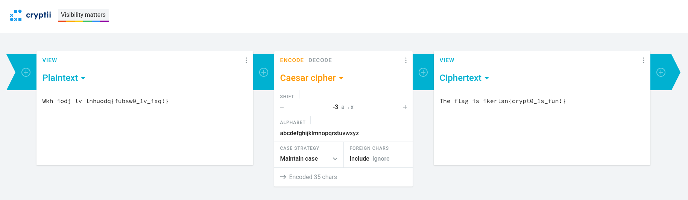

# El Mensaje Oculto — Crypto | 100 pts | Easy

## Description

> An important message has been intercepted, but it appears to have been altered using a very ancient encryption method. It is rumored to have been encrypted with a simple substitution method, where each letter of the alphabet is shifted a fixed number of positions. The key is a very small number. Can you decrypt it and find the message?

## Hints

> **Hint 1 (free):** This encryption method is named after a famous Roman emperor. Try small shifts, typically between 1 and 25.

> **Hint 2 (free):** The method is simple: a regular shift. The message is encrypted with the system of its most famous namesake. How many steps are needed to return to the original alphabet?

> **Hint 3 (25 pts):** Not used — the two free hints were enough to solve the challenge.

## Files

`mensaje.txt`:
```
Wkh iodj lv lnhuodq{fubsw0_1v_ixq!}
```

## Solution

The challenge description gives away quite a few hints: simple substitution cipher, fixed shift, small number, and references to a "famous Roman emperor". This all points to the **Caesar cipher**.

The Caesar cipher works by shifting each letter of the alphabet by a fixed number of positions. To decrypt it, we just apply the reverse shift. Since the key is described as "very small", we try low values.

Using [cryptii.com](https://cryptii.com/pipes/caesar-cipher) with a shift of **-3** (ROT3), the ciphertext:

```
Wkh iodj lv lnhuodq{fubsw0_1v_ixq!}
```

decodes to:

```
The flag is ikerlan{crypt0_1s_fun!}
```



## Flag

```
ikerlan{crypt0_1s_fun!}
```
